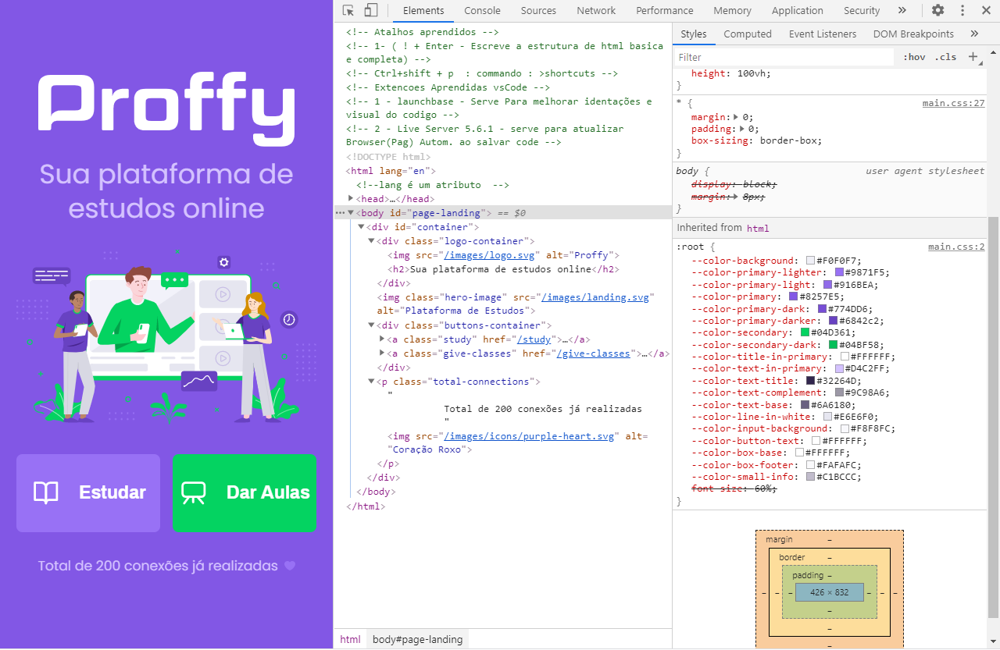
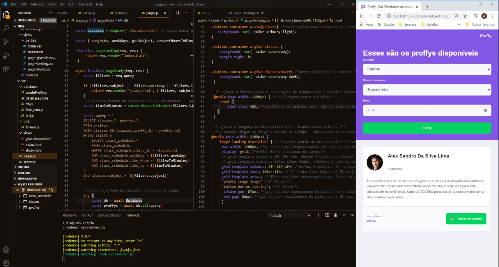
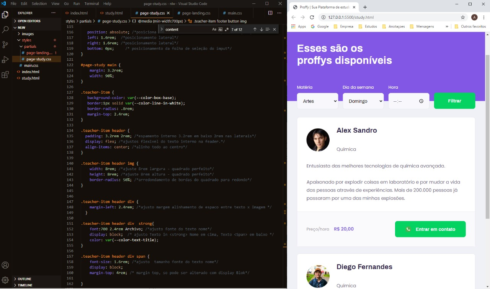
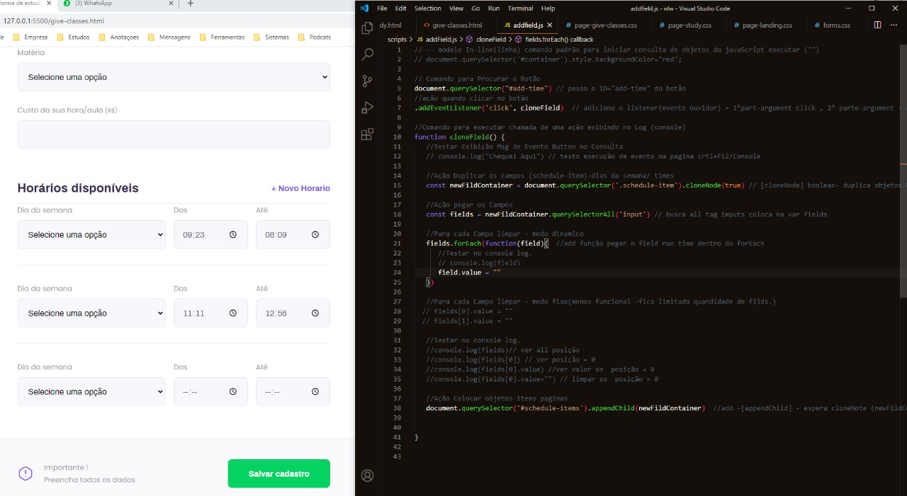
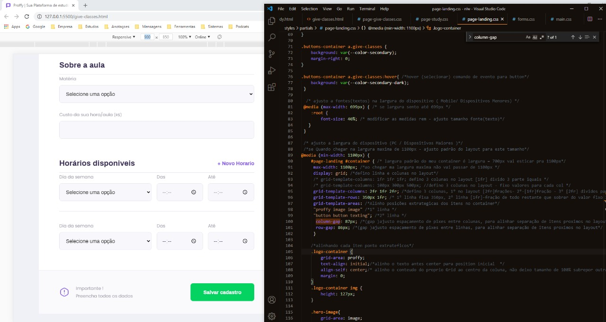
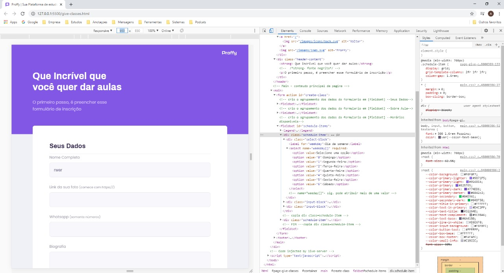
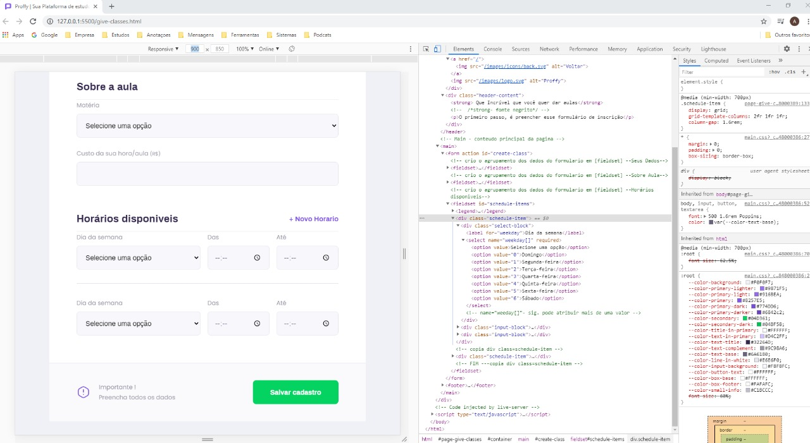
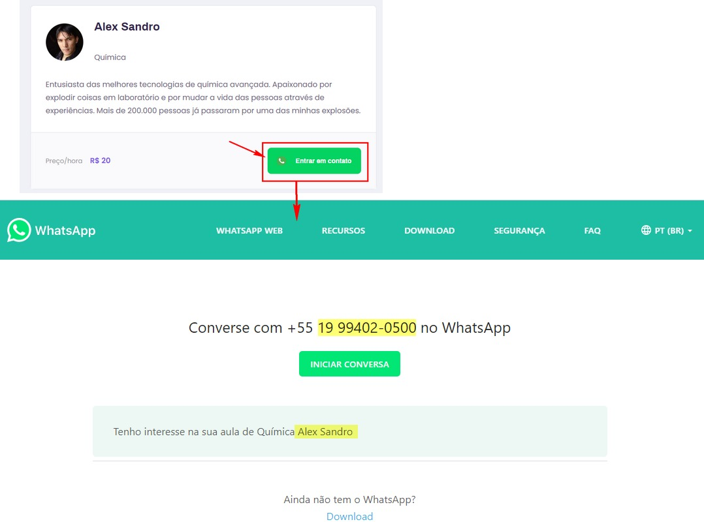

# Proffy

<div align="center">
<!--  -->

</div>

# Indice
- [Sobre](#-Sobre)
- [Tecnologias Utilizadas](#-Tecnologias-Utilizadas)
- [Como Baixar o Projeto](#-Como-Baixar-o-Projeto)

## 🔖 Sobre
###### Este Projeto faz parte de um evento do qual tive a oportunidade de participar, onde foi sugerido a **NLW2**, neste pude aprender mais sobre as seguintes técnologias e partilhar conhecimentos com diversos outros desenvolvedores com objetivo principal de criação de um sistema onde alunos podem encontrar professores online para receber aulas; E professores podem se cadastrar no sistema para oferecer seus srviços e ministrar aulas. Aplicação trabalha as duas partes do mercado, que seriam a oferta e demanda.

###### **Evento :** Next Level Week 2ª Edição - [Rocketseat](https://rocketseat.com.br)
###### **Instrutor :** Mayk Brito
---

## 📌 Instruções : 
Para iniciar o Servidor da aplicação use o comando: **_npm run dev_** então acesse pelo navegador **_http://127.0.0.1:5500/_** 


## 🚀 **Tecnologias utilizadas**
- **HTML** - Front-End;
- **CSS** - Front-End;
- **Nunjucks** (Template Engine) - Front-End
- **JAVASCRIPT** - Back-End;
- **SQLITE** - Persistência dos dados.

---

## 💻 **Prints**

<div align="center">









</div>
<br>

---

## 📁 Como Baixar o Projeto
```bash
  # Clonar o repósitorio
  $ git clone https://github.com/alxlima/Proffy
  
  # Entrar no diretório
  $ cd c:/nlw

  # Instalar as dependências
  $ yarn install
  
  # Iniciar o Projeto
  $ yarn start
```
---
 Desenvolvido 🚀 por: ***_Alex Sandro da Silva lima_***